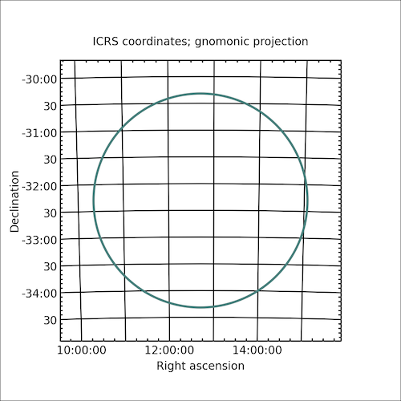

.. _plotting-examples-label:

Plotting Examples
=================

The underlying `starlink-pyast <http://starlink.github.io/starlink-pyast/pyast.html>`_ library has a rich functionality for handling plotting on multiple world coordinate systems. The interface is very extensible and provides hooks for custom plot interfaces.

Plotting support is not complete, but more than sufficient for checks like verifying regions.

Matplotlib Interface
--------------------

``starlink-pyast`` provides a wrapper for plotting with Matplotlib. Cornish goes further by creating routines that overlay these to interact with the Cornish objects in as simple a manner as possible. The primary interface is the :class:`~cornish.plot.matplotlib.SkyPlot` object.

The following is a very simple example of how to plot a circle in an ICRS frame on the sky:

.. code-block:: python

	from cornish import ASTCircle
	from cornish.plot.matplotlib import SkyPlot
	import astropy.units as u
	from astropy.coordinates import SkyCoord
	
	# define a circle in the ICRS frame (used by default)
	center = SkyCoord(ra="12d42m22s", dec="-32d18m58s")
	circle = ASTCircle(center=center, radius=2.0*u.deg)
	
	# define a new plot of 5x5 inches
	# set the extent of the plot to 1.25 x the circle radius to leave some room
	skyplot = SkyPlot(extent=circle*1.25, figsize=(5,5))

	# add region to plot
	skyplot.addRegionOutline(circle)

	# display
	skyplot.show()

The result is:

Repeat the same with a polygon converted from the circle.

.. code-block:: python

	from cornish import ASTCircle
	from cornish.plot.matplotlib import SkyPlot
	import astropy.units as u
	from astropy.coordinates import SkyCoord
	
	# define a circle in the ICRS frame (used by default)
	center = SkyCoord(ra="12d42m22s", dec="-32d18m58s")
	circle = ASTCircle(center=center, radius=2.0*u.deg)
	
	# define a new plot of 5x5 inches
	# set the extent of the plot to 1.25 x the circle radius to leave some room
	skyplot = SkyPlot(extent=circle*1.25, figsize=(5,5))

	# add region to plot
	skyplot.addRegionOutline(circle)
	skyplot.addRegionOutline(circle.toPolygon(npoints=8), color="#3b85f7")

	# display
	skyplot.show()

The result is:
	
	.. image:: _static/circle+polygon_region_plot.png
		
.. todo:: Link to Trillian docs to demonstrate plotting via the Trillian API.

Other Interfaces
----------------

Currently only the Matplotlib interface is supported. More are planned.
